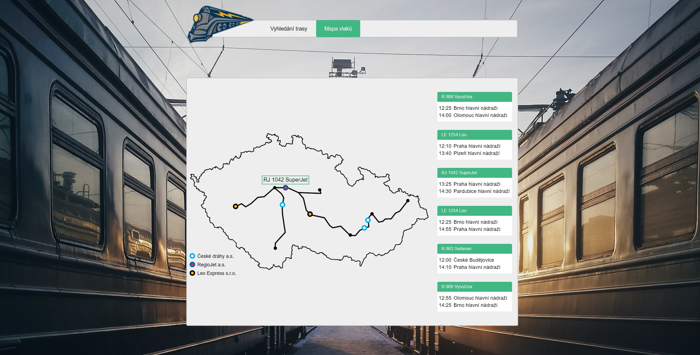
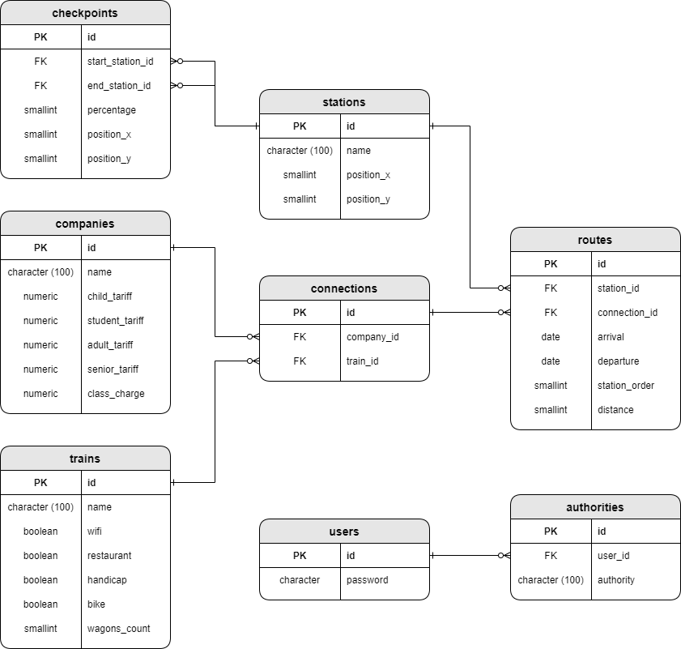

# 9. Railway System

  
  

  

## Description
REST web application providing train timetables    

## Technology
Spring Boot  
Spring Security  
Hibernate  
Vue.js  
PostgreSQL  
JUnit / Mockito    

## SQL Diagram

